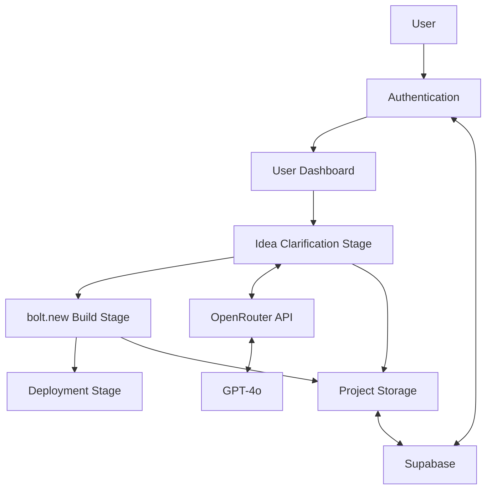
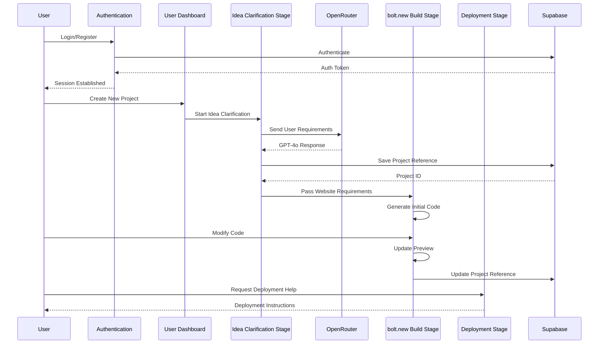
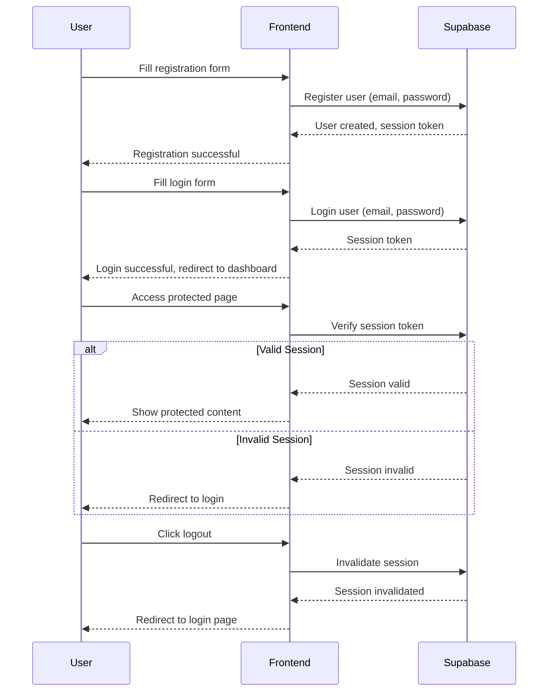

# NoFuss AI Coder - Architecture Plan

## 1. System Overview

NoFuss AI Coder is a beginner-focused, AI-assisted website builder with three main stages:

1. **Idea Clarification Stage**: A pre-builder chat powered by GPT-4o via OpenRouter to help users define their website requirements.
2. **bolt.new Build Stage**: Using the bolt.new package to provide an integrated coding and preview environment.
3. **Deployment Stage**: A DeployHelper role in the bolt.new chat interface that guides users through deploying their website.

## 2. System Components and Interactions



### Component Descriptions:

1. **Authentication**: Handles user registration, login, and session management using Supabase Auth.

2. **User Dashboard**: Displays user's projects and allows creation of new projects.

3. **Idea Clarification Stage**: 
   - Provides a chat interface powered by GPT-4o via OpenRouter
   - Helps users clarify their website requirements
   - Generates a structured output that can be used by the Build Stage

4. **bolt.new Build Stage**:
   - Integrates the bolt.new package for code editing and preview
   - Takes input from the Idea Clarification Stage
   - Provides a coding environment with AI assistance

5. **Deployment Stage**:
   - Implements the DeployHelper role in the bolt.new chat
   - Guides users through deploying to platforms like Vercel, Netlify, or GitHub Pages

6. **Project Storage**:
   - Stores project references in Supabase
   - Actual project content is managed by bolt.new

## 3. Data Flow Between Components



## 4. API Endpoints

### Authentication Endpoints (handled by Supabase)
- POST `/auth/register` - Register a new user
- POST `/auth/login` - Login existing user
- POST `/auth/logout` - Logout user
- GET `/auth/user` - Get current user info

### Project Endpoints
- GET `/api/projects` - List user's projects
- POST `/api/projects` - Create a new project
- GET `/api/projects/:id` - Get project details
- PUT `/api/projects/:id` - Update project details
- DELETE `/api/projects/:id` - Delete a project

### Idea Clarification Endpoints
- POST `/api/idea/chat` - Send message to GPT-4o
- GET `/api/idea/export/:projectId` - Export idea to build stage

### Build Stage Endpoints
- GET `/api/build/:projectId` - Get build environment for a project
- POST `/api/build/:projectId/save` - Save project state

### Deployment Endpoints
- GET `/api/deploy/options` - Get available deployment options
- POST `/api/deploy/instructions/:platform` - Get deployment instructions for a platform

## 5. Database Schema for Supabase

### Users Table
```sql
CREATE TABLE users (
  id UUID PRIMARY KEY REFERENCES auth.users,
  email TEXT UNIQUE NOT NULL,
  created_at TIMESTAMP WITH TIME ZONE DEFAULT NOW(),
  updated_at TIMESTAMP WITH TIME ZONE DEFAULT NOW()
);
```

### Projects Table
```sql
CREATE TABLE projects (
  id UUID PRIMARY KEY DEFAULT uuid_generate_v4(),
  user_id UUID REFERENCES users(id) NOT NULL,
  name TEXT NOT NULL,
  description TEXT,
  bolt_project_id TEXT NOT NULL,
  idea_summary JSONB,
  created_at TIMESTAMP WITH TIME ZONE DEFAULT NOW(),
  updated_at TIMESTAMP WITH TIME ZONE DEFAULT NOW()
);
```

### Project History Table
```sql
CREATE TABLE project_history (
  id UUID PRIMARY KEY DEFAULT uuid_generate_v4(),
  project_id UUID REFERENCES projects(id) NOT NULL,
  action TEXT NOT NULL,
  metadata JSONB,
  created_at TIMESTAMP WITH TIME ZONE DEFAULT NOW()
);
```

## 6. File Structure for Next.js Application

```
nofuss-ai-coder/
├── .github/                    # GitHub workflows
├── public/                     # Static assets
├── src/
│   ├── app/                    # Next.js App Router
│   │   ├── api/                # API routes
│   │   │   ├── auth/           # Auth API routes
│   │   │   ├── projects/       # Project API routes
│   │   │   ├── idea/           # Idea stage API routes
│   │   │   ├── build/          # Build stage API routes
│   │   │   └── deploy/         # Deploy stage API routes
│   │   ├── auth/               # Auth pages
│   │   │   ├── login/          # Login page
│   │   │   └── register/       # Register page
│   │   ├── dashboard/          # Dashboard page
│   │   ├── projects/           # Projects pages
│   │   │   ├── [id]/           # Single project page
│   │   │   │   ├── idea/       # Idea stage page
│   │   │   │   ├── build/      # Build stage page
│   │   │   │   └── deploy/     # Deploy stage page
│   │   │   └── new/            # New project page
│   │   ├── layout.tsx          # Root layout
│   │   └── page.tsx            # Home page
│   ├── components/             # Reusable components
│   │   ├── ui/                 # UI components
│   │   ├── auth/               # Auth components
│   │   ├── dashboard/          # Dashboard components
│   │   ├── idea/               # Idea stage components
│   │   ├── build/              # Build stage components
│   │   └── deploy/             # Deploy stage components
│   ├── lib/                    # Utility functions
│   │   ├── supabase/           # Supabase client
│   │   ├── openrouter/         # OpenRouter client
│   │   └── bolt/               # bolt.new integration
│   ├── hooks/                  # Custom hooks
│   ├── types/                  # TypeScript types
│   ├── styles/                 # Global styles
│   └── context/                # React context
├── .env.local                  # Environment variables
├── .gitignore
├── next.config.js
├── package.json
├── tailwind.config.js
└── tsconfig.json
```

## 7. Authentication Flow



## 8. Deployment Strategy

### Development Environment
- Local development using Next.js development server
- Supabase local development setup
- Environment variables for API keys and configuration

### Staging Environment
- Vercel preview deployments for frontend
- Supabase staging project
- Automated testing before production deployment

### Production Environment
- Vercel for hosting the Next.js application
- Supabase production project
- CI/CD pipeline for automated deployments

### Monitoring and Analytics
- Vercel Analytics for frontend performance
- Supabase monitoring for backend
- Custom logging for application-specific events

## 9. Integration Points

### OpenRouter Integration
- API client for communicating with OpenRouter
- Environment variables for API keys
- Rate limiting and error handling

### bolt.new Integration
- Install and configure the bolt.new package
- Custom UI components for the bolt.new interface
- Integration with the Idea Clarification Stage output
- Implementation of the DeployHelper role

### Supabase Integration
- Authentication using Supabase Auth
- Database access using Supabase client
- Real-time updates using Supabase subscriptions

## 10. Security Considerations

- All API keys stored as environment variables
- Authentication required for all protected routes
- CSRF protection for all API endpoints
- Input validation for all user inputs
- Rate limiting for API endpoints
- Content Security Policy (CSP) for frontend

## 11. Scalability Considerations

- Serverless architecture for automatic scaling
- Efficient database queries with proper indexing
- Caching strategies for frequently accessed data
- Optimized asset delivery with CDN

## 12. Future Expansion Possibilities

- Additional deployment targets
- More advanced AI features
- Template marketplace
- Collaboration features
- Custom domain support